# Project 3: Setup Load Balancing for Static Website Using Nignx
This project aims to teach Layer 7 load balancing and load balancing algorithms using Nginx as a Load Balancer.

## Type of Load Balancer
This is a reverse proxy load balancer configuration in Nginx, where Nginx acts as an intermediary for requests from clients seeking resources from the servers behind it. It's capable of distributing traffic across the servers listed in the upstream block.
## Characteristics
HTTP Load Balancing: This configuration balances HTTP requests.
Round Robin: By default, Nginx uses a round-robin algorithm to distribute traffic evenly among the servers unless otherwise specified.
Scalability: You can add more servers in the upstream block to scale out your application.

Tasks                                                                   |
|----|---------------------------------------------------------------------------------|

| 1  |Deploy three servers 

        |
| 2  | Set up static websites on two servers using Nginx.         
                |
| 3  | Use two separate HTML files with distinct content. Deploy one file to each server's index.html 
location.                                         |
| 4  |Set up Nginx on the third server. It will act as a load balancer.     

   |
| 5  |Configure Nginx to load and balance traffic between two static websites.

                |
| 6  |Add the Nginx Load balancer IP to the DNS A record.       

                      |
| 7  |Try accessing the website. Every time you reload the website you should see a different index.html.
                     |

Checklist
 - Task 1: Deploy three servers.
 - Task 2: Set up static websites on two servers using Nginx.
 - Task 3: Make a small change in the index.html file of one of the websites to differentiate between two servers OR  For a clearer distinction, use two separate HTML files with distinct content.
 - Task 4: Set up Nginx on the third server. It will act as a load balancer.
 - Task 5: Configure Nginx to load and balance traffic between two static websites.
 - Task 6: Add the Nginx Load balancer IP to the DNS A record.
 - Task 7: Try accessing the website. Every time you reload the website you should see a different index.html.
 
 # Documentation 
 Project1 was used as  guidance on spinning up an Ubuntu server, as well as creating and associating an elastic IP address with your server, among other tasks.

 3 ubuntu servers was spinned up

 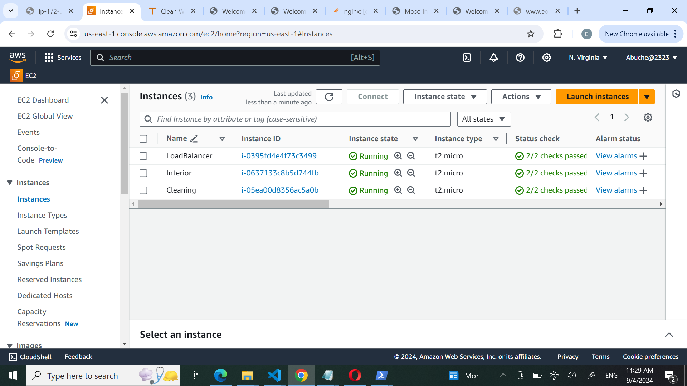

## Install Nginx and Setup Your Website

Website template  was downloaded from your www.tooplate.com

Right click and select Inspect from the drop down menu
 * Click on the Network tab
 * Click the Download button and right click on the website name
 * Select Copy and click on Copy URL.

 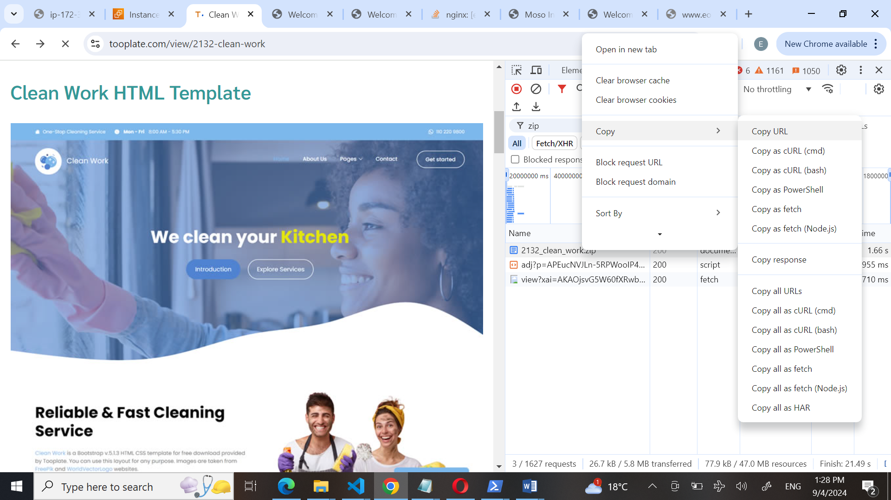

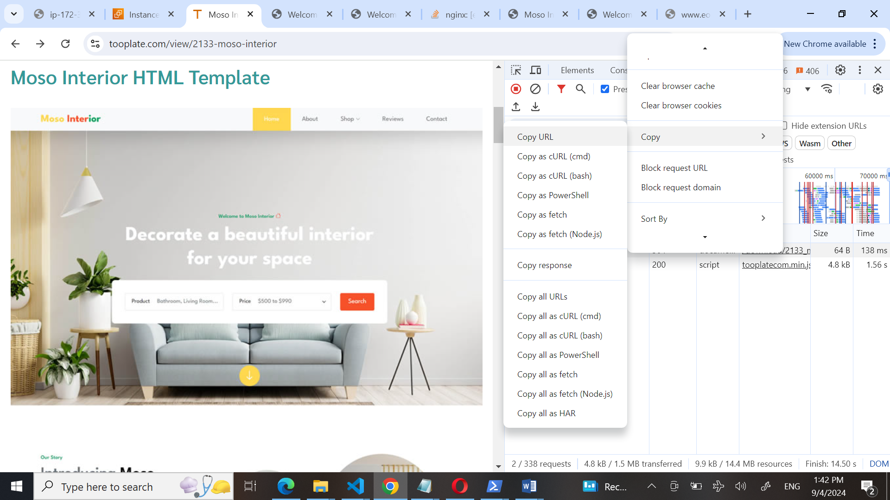

 

## To install Nginx, execute the following commands on your terminal.

sudo apt update

sudo apt upgrade

sudo apt install nginx

* Start your Nginx server by running the sudo systemctl start nginx command, enable it to start on boot by executing sudo systemctl enable nginx, and then confirm if it's running with the sudo systemctl status nginx command.

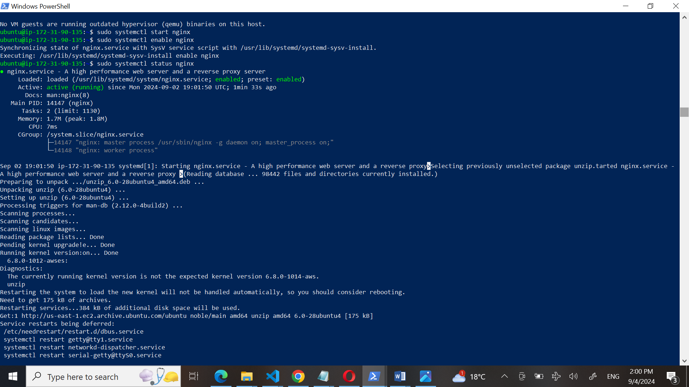

* Visit your instances IP address in a web browser to view the default Nginx startup page.

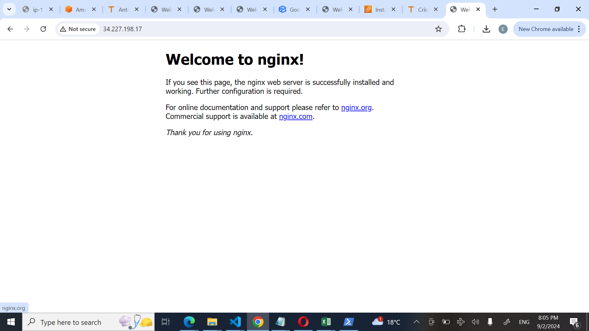

*  I executed sudo apt install unzip to install the unzip tool and run the following command to download and unzip your website files sudo curl -o /var/www/html/2133_moso_interior.zip https://www.tooplate.com/zip-templates/2133_moso_interior.zip && sudo unzip -d /var/www/html/ /var/www/html/2133_moso_interior.zip && sudo rm -f /var/www/html/2133_moso_interior.zip for both website

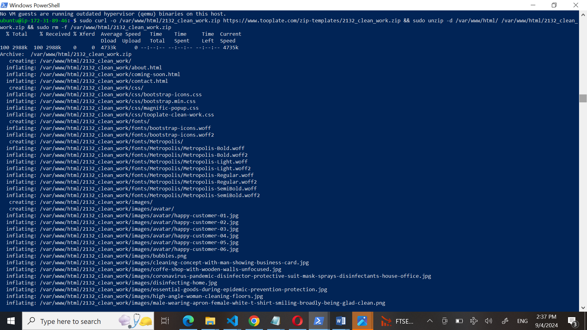

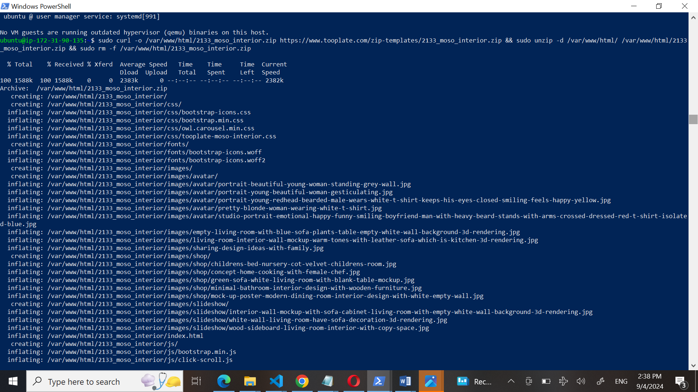

I set up your website's configuration for both website on their different terminal, start by creating a new file in the Nginx sites-available directory. Use the following command to open a blank file in a text editor: sudo nano /etc/nginx/sites-available/interior. same for the second website

server {
    listen 80;

    server_name example.com www.example.com;

    root /var/www/html/2133_moso_interior;
    index index.html;

    location / {
        try_files $uri $uri/ =404;
    }
}

* Edit the root directive within your server block to point to the directory where your downloaded website content is stored.

* Create a symbolic link for both websites ( Interior/ Cleaning) by running the following command. sudo ln -s /etc/nginx/sites-available/interior /etc/nginx/sites-enabled/

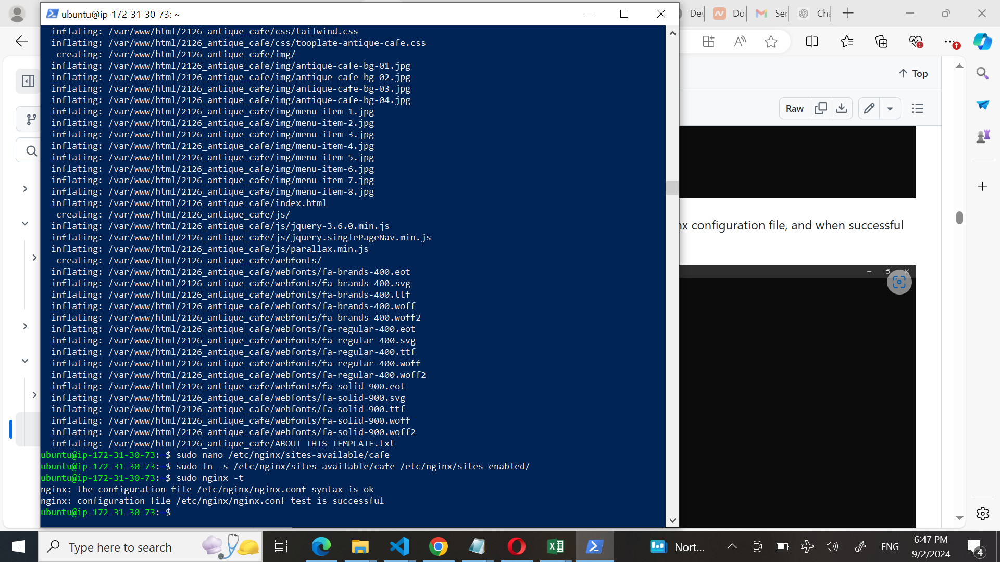

* Run the sudo nginx -t command to check the syntax of the Nginx configuration file, and when successful run the sudo systemctl restart nginx command.

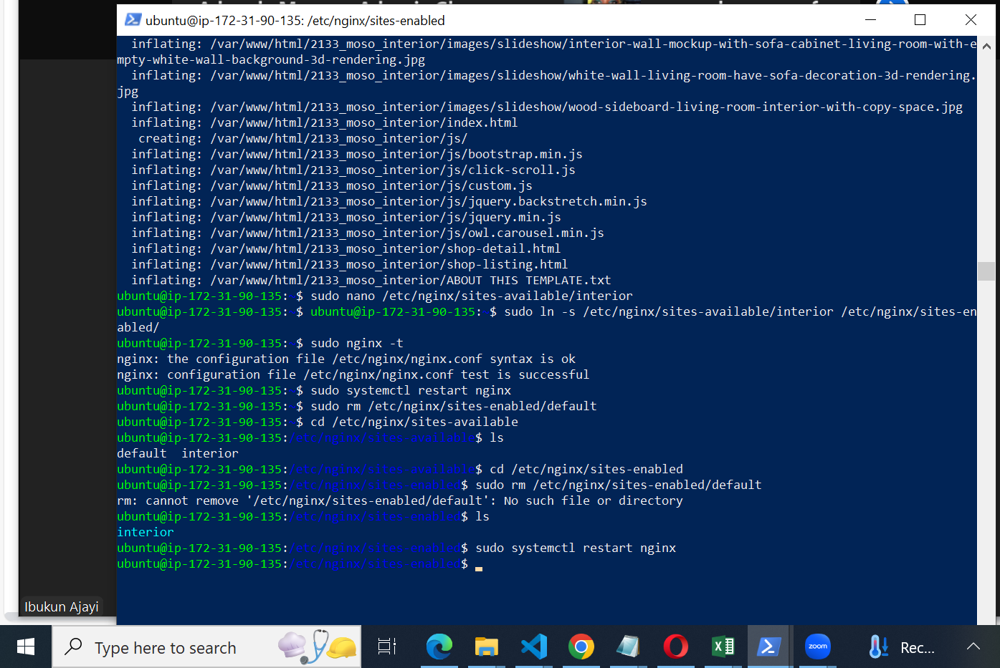

* On your first server, i ran  sudo rm /etc/nginx/sites-enabled/default, and on second server, i ran sudo rm /etc/nginx/sites-enabled/default. This will delete the default site-enabled folders and enable Nginx to serve content from your specified website directories. If the default folders is not deleted, you'll continue to see the default Nginx page.

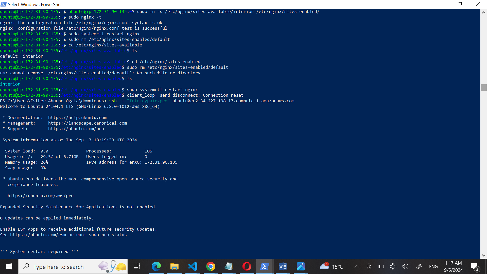

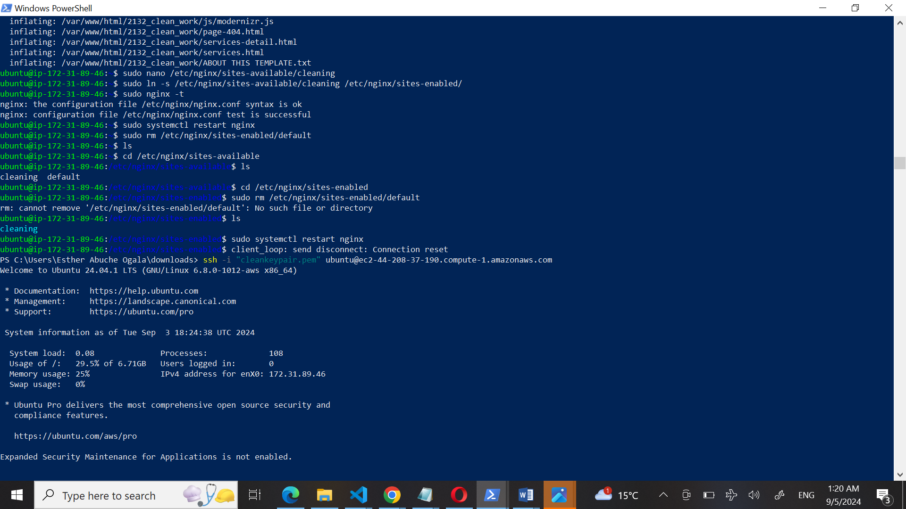

* Run the sudo systemctl restart nginx command to restart your server.

* Check both IP addresses to confirm your website is up and running.

# Configure your Load balancer

Install Nginx on the server you want to use as a load balancer, and execute sudo systemctl status nginx to ensure it's running.

* Execute sudo nano /etc/nginx/nginx.conf to edit your Nginx configuration file.

* Add the following within the http block.

}

server {
    listen 80;
    server_name eogala1818.xyz www.eogala1818.xyz ;

    location / {
        proxy_pass http://eogala18;
    }
}

 upstream eogala1818 {
    server 34.227.198.17;
    server 44.208.37.190;
    # Add more servers as needed
}

server {
    listen 80;
    server_name eogala1818.xyz www.eogala1818.xyz;

    location / {
        proxy_pass http://eogala1818;
    }
}

Run sudo nginx -t to check for syntax error.

Apply the changes by restarting Nginx: sudo systemctl restart nginx

# Create An A Record

